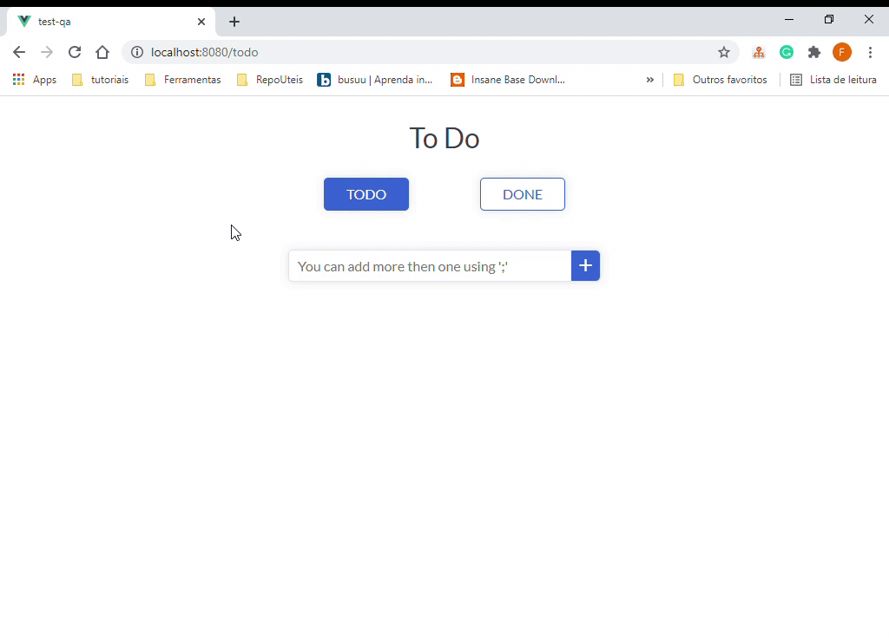
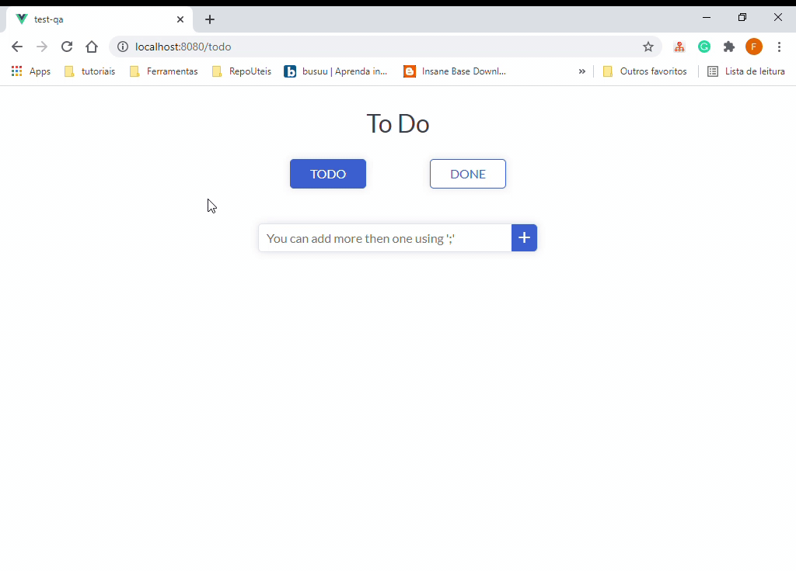

# Sobre o projeto:

Trata-se de uma automação de front-end escrita em ruby, visando validar as funcionalidades da ferramenta To Do.

Principais pacotes utilizados:

- Capybara

- Cucumber

- Selenium Webdriver

- RubyXL


# Observações:

Foram adicionados IDs a alguns elementos do projeto To Do, são eles:

- #title -> ao h1 de titulo
- #clear-input -> ao button que limpa a caixa de texto
- #add-task-input -> ao input de adicionar tarefa
- #add-task-button -> ao button de adicionar tarefa
- #done-button -> ao link para a pagina de tarefas concluidas
- #search-task -> ao input de pesquisa de tarefas

Estes elementos estão mapeados na automação dentro do arquivo:
```
/data/elements.yml
```

# Estrutura do projeto:

- features -> Aqui é a pasta principal que armazena todas as pastas de funcionalidades.
  - spec -> Fica responsável pelos BDDs, separando as features por paginas.
    - to_do.feature -> Responsavel pelos cenários de testes envolvendo a pagina de To Do. Cada cenário tem sua propria tag e tags para rodar em conjunto. Também há um reaproveitamento de steps em comum.
    - done.feature -> Responsavel pelos cenários de testes envolvendo a pagina de Done. O mesmo conceito de tags e steps apresentados em To Do se aplica aqui.

  - step_definitions -> Fica responsável pelos passos (steps) dos BDDs, ligando-os com o código do teste em sí.
      - to_do.rb
      - done.rb

  - suport -> Onde os scripts são organizados.
    - pages -> Onde ficam os arquivos de código.
      - PaginaToDo.rb -> Classe e métodos que testam as funcionalidades da pagina To Do.
      - PaginaDone.rb -> Classe e métodos que testam as funcionalidades da pagina Done.
      - PaginaHelper.rb -> Onde são gerados blocos de código genéricos que auxiliam no projeto como um todo.

    - env.rb -> Prepara o ambiente antes da execução dos testes.
    - hooks.rb -> configura ações para antes e depois de cada cenário. Também configura o relatório ao final do teste.

  - data -> Armazena od elementos mapeados e os relatórios.
    - elements.yml -> onde estão mapeados alguns elementos chave, para facilitar a manutenção do código.
    - relatorio.xlsx -> Relatório local com resumo dos resultados por cenário.
  
  - Gemfile -> Onde os pacotes utilizados são listados.
  - cucumber.yml -> Onde são feitas algumas configurações de execução.

# Rodar o projeto:

> Execução Simples
- O projeto podera ser executado com o comando:
```
cucumber
```
> Execução com seleção de tag
- Também podemos selecionar o navegador e as tags desejadas:
```
cucumber -t @geral chrome=true
```

> Realtórios
- Ao final do teste serão gerados dois relatórios
  - Cucumber report: disponibilizado através de um link no final da execução
  

  - Relatório em Excel: disponibilizado no final da execução na pasta Data
  


# Bugs encontrados.

Durante as validações foram encontrados alguns bugs, os quais separei por categoria:

- Funcionalidade
  - Ao inserir uma tarefa com muitos caracteres, o checkbox de conclusão de tarefas não é apresentado (Figura 1).
  - Ao excluir uma tarefa na pagina Done, a lista não é atualizada (Figura 2)

- Layout
  - Ao inserir uma tarefa com muitos caracteres, o texto e o botão de excluir ultrapassam a area delimitada para eles. (Figura 1)

- Usabilidade
  - A pesquisa por uma tarefa é Case Sensitive, o que pode dificultar o uso da ferramenta.(Figura 2)

> Figura 1


> Figura 2

